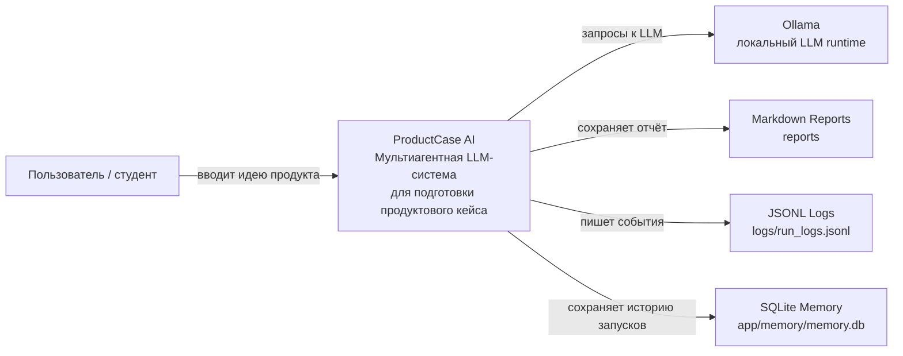

# C4 Context Diagram

```mermaid
flowchart LR
    user["Пользователь / студент"]

    system["ProductCase AI<br/>Мультиагентная LLM-система<br/>для подготовки продуктового кейса"]

    ollama["Ollama<br/>локальный LLM runtime"]

    reports["Markdown Reports<br/>reports"]

    logs["JSONL Logs<br/>logs/run_logs.jsonl"]

    memory["SQLite Memory<br/>app/memory/memory.db"]

    user -->|"вводит идею продукта"| system
    system -->|"запросы к LLM"| ollama
    system -->|"сохраняет отчёт"| reports
    system -->|"пишет события"| logs
    system -->|"сохраняет историю запусков"| memory
```