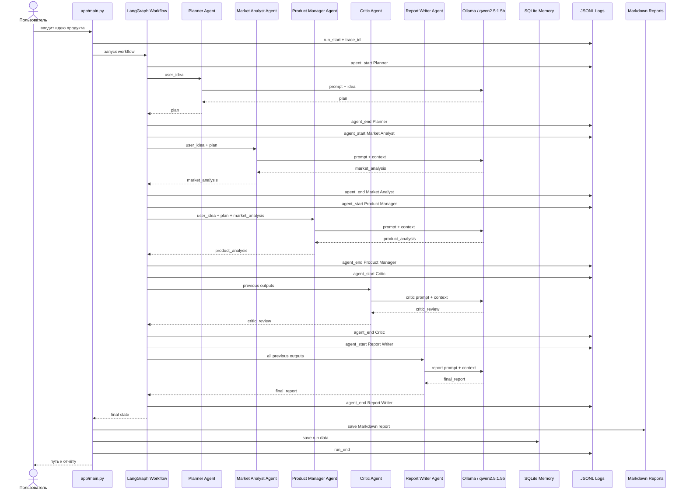

# Sequence Diagram

```mermaid
sequenceDiagram
    actor User as Пользователь
    participant Main as app/main.py
    participant Graph as LangGraph Workflow
    participant Planner as Planner Agent
    participant Market as Market Analyst Agent
    participant PM as Product Manager Agent
    participant Critic as Critic Agent
    participant Writer as Report Writer Agent
    participant Ollama as Ollama / qwen2.5:1.5b
    participant Memory as SQLite Memory
    participant Logs as JSONL Logs
    participant Reports as Markdown Reports

    User->>Main: вводит идею продукта
    Main->>Logs: run_start + trace_id
    Main->>Graph: запуск workflow

    Graph->>Logs: agent_start Planner
    Graph->>Planner: user_idea
    Planner->>Ollama: prompt + idea
    Ollama-->>Planner: plan
    Planner-->>Graph: plan
    Graph->>Logs: agent_end Planner

    Graph->>Logs: agent_start Market Analyst
    Graph->>Market: user_idea + plan
    Market->>Ollama: prompt + context
    Ollama-->>Market: market_analysis
    Market-->>Graph: market_analysis
    Graph->>Logs: agent_end Market Analyst

    Graph->>Logs: agent_start Product Manager
    Graph->>PM: user_idea + plan + market_analysis
    PM->>Ollama: prompt + context
    Ollama-->>PM: product_analysis
    PM-->>Graph: product_analysis
    Graph->>Logs: agent_end Product Manager

    Graph->>Logs: agent_start Critic
    Graph->>Critic: previous outputs
    Critic->>Ollama: critic prompt + context
    Ollama-->>Critic: critic_review
    Critic-->>Graph: critic_review
    Graph->>Logs: agent_end Critic

    Graph->>Logs: agent_start Report Writer
    Graph->>Writer: all previous outputs
    Writer->>Ollama: report prompt + context
    Ollama-->>Writer: final_report
    Writer-->>Graph: final_report
    Graph->>Logs: agent_end Report Writer

    Graph-->>Main: final state
    Main->>Reports: save Markdown report
    Main->>Memory: save run data
    Main->>Logs: run_end
    Main-->>User: путь к отчёту
```